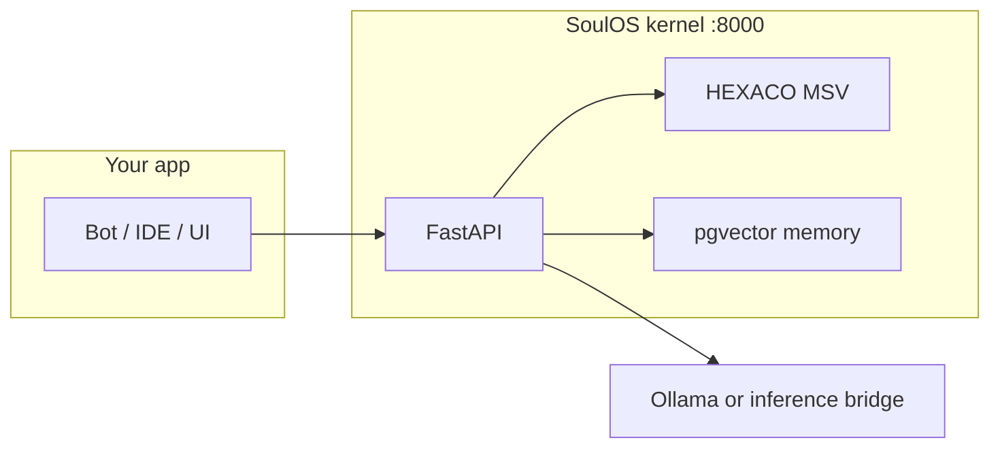

# SoulOS

**Open-source runtime for persistent AI avatars** — validated personality (HEXACO MSV), episodic memory (pgvector), dual-process chat with live telemetry, MCP for Cursor/Claude, and Soul Studio to build `.soul` files in the browser.

Give your bot a **soul file** instead of a fragile system prompt. Same REST API, Python/TypeScript SDK, or MCP — self-host with Docker or use the cloud gateway.

<p align="center">
  <a href="https://github.com/mziqudhd92/soul-os/actions/workflows/ci.yml"></a>
  <a href="https://github.com/mziqudhd92/soul-os/blob/main/LICENSE"></a>
  <a href="https://mziqudhd92.github.io/soul-os/"></a>
</p>

**Tutorials (interactive)** · [GitHub Pages](https://mziqudhd92.github.io/soul-os/) · [Python bot guide](docs/guides/python-bot.md) · [Full docs](docs/README.md) · [FAQ](#faq)

---

## New here? Do this first

**You need:** [Docker](https://docs.docker.com/get-docker/) (Docker Desktop or Engine). Optional: Python 3.12+ for Studio-only mode.

### 1. Run the stack

```bash
git clone https://github.com/mziqudhd92/soul-os.git
cd soul-os
docker compose up --build
```

Wait until the kernel is up (first build can take several minutes).

| Service | URL | What it does |
|---------|-----|----------------|
| **Kernel** | http://localhost:8000 | API, chat SSE, MCP |
| **Soul Studio** | http://localhost:8765 | Build souls, tutorials, test chat |
| **Gateway** (optional) | http://localhost:8080 | Cloud-style API proxy |

### 2. Pick how you want to learn

| I want to… | Start here | Time |
|------------|------------|------|
| **Wire SoulOS into my Python bot** (recommended) | [Interactive tutorial](https://mziqudhd92.github.io/soul-os/?tutorial=python-bot) or [Python bot guide](docs/guides/python-bot.md) | ~25 min |
| **Click around in a UI** | Open http://localhost:8765 → **Wizard** or **Tutorials** | ~15 min |
| **Test the API with curl** (no code) | [Quickstart Path A](docs/getting-started/quickstart.md#path-a) | ~10 min |
| **Use SoulOS from Cursor / Claude** | [MCP guide](docs/guides/mcp.md) → `http://localhost:8000/mcp/sse` | ~15 min |
| **Deploy on my own servers** | [Plug in SoulOS](docs/guides/plug-in-soulos.md) · [Self-hosted](docs/deployment/self-hosted.md) | ~15 min |
| **Add SoulOS to my existing LLM app** | [Hybrid orchestrator](docs/guides/hybrid-orchestrator.md) | ~20 min |

### 3. Register a soul and chat (minimal API smoke test)

```bash
# Register example support bot (JSON)
curl -s -X POST http://localhost:8000/v1/avatars \
  -H "Content-Type: application/json" \
  -d @examples/support-bot/support-bot.soul.json

# Save the returned "id" as BOT_ID, then teach one fact:
curl -X POST http://localhost:8000/memory/ingest \
  -H "Content-Type: application/json" \
  -d '{"bot_id":"<BOT_ID>","content":"Refunds within 30 days of purchase."}'

# Stream a reply (SSE)
curl -N -X POST http://localhost:8000/chat/generate \
  -H "Content-Type: application/json" \
  -d '{"bot_id":"<BOT_ID>","message":"Can I get a refund?"}'
```

You should see `event: message` chunks and optional `event: msv_update` / `event: cognitive_state` lines.

---

## What is SoulOS?

SoulOS is **not** a chat UI and **not** a replacement for your LLM. It is the layer that sits between your app and the model:

- **Personality** — HEXACO psychometrics in a validated `.soul` / `.soul.json` file; state drifts per turn (`msv_update`).
- **Memory** — episodic facts in Postgres/pgvector; optional `.soul-memory/` git ledger + sync API.
- **Orchestration** — dual-process routing (fast System 1 stream + System 2 reflection when uncertainty is high).
- **Integrations** — REST + SSE, Python/`@soulos/sdk`, MCP tools at `/mcp/sse`.

**Typical use cases:** customer support bots, dev assistants, companions, Cursor/Claude agents with persistent identity and recall.

---

## Soul Studio

Browser UI for designing souls, reading docs, and running **interactive tutorials** (animations, SSE playground, step-by-step code).

```bash
# Included in docker compose, or run alone (kernel must be on :8000):
pip install -e packages/soulos-studio
soulos-studio
```

- Local: http://localhost:8765
- Online tutorials (no Docker): https://mziqudhd92.github.io/soul-os/

Studio can **export** `.soul` and `.soul.json`, **deploy** to the kernel, and **test chat** with cognitive rails.

Guide: [Soul Builder](docs/getting-started/soul-builder.md)

---

## Python integration (sketch)

```python
import asyncio
from soulos.client import SoulOSClient

async def main():
    soul = SoulOSClient(base_url="http://localhost:8000")
    avatar = await soul.register_avatar("examples/support-bot/support-bot.soul")
    avatar_id = avatar["id"]
    await soul.ingest_memory(avatar_id, "Refunds within 30 days.")

    parts = []
    async for event in soul.send_message(avatar_id, "Can I get a refund?"):
        if event["type"] == "message":
            parts.append(event["text"])
        if event["type"] == "cognitive_state":
            print("path:", event.get("current_path"))
    print("".join(parts))

asyncio.run(main())
```

Full walkthrough: [Python bot integration](docs/guides/python-bot.md)

---

## TypeScript / Node

```bash
npm install @soulos/sdk   # from monorepo: npm run build:sdk
```

```typescript
import { SoulOSClient } from "@soulos/sdk";
import { registerAvatarFromFile } from "@soulos/sdk/node";

const soul = new SoulOSClient({ baseUrl: "http://localhost:8000" });
const { id } = await registerAvatarFromFile(soul, "./examples/support-bot/support-bot.soul.json");

for await (const e of soul.sendMessage(id, "I need a refund")) {
  if (e.type === "message") process.stdout.write(e.text);
}
```

Cloud: `new SoulOSClient({ apiKey: process.env.SOULOS_API_KEY })`

---

## MCP (Cursor, Claude Desktop)

With `docker compose up` running:

```text
http://localhost:8000/mcp/sse
```

Tools include `ingest_memory`, `retrieve_memory`, `get_identity`, `register_avatar`, and more. Chat streaming uses REST/SDK, not MCP.

- [MCP guide](docs/guides/mcp.md)
- [examples/mcp](examples/mcp/README.md)

---

## Architecture



| SSE event | Meaning |
|-----------|---------|
| `message` | Token/chunk from the model |
| `msv_update` | Personality state drift (e.g. epistemic uncertainty) |
| `cognitive_state` | System 1 vs System 2 path, latency, confidence |

Details: [API reference](docs/reference/api.md) · [Psychometrics](docs/guides/psychometrics.md)

---

## Repository layout

```text
packages/soulos-core/      Kernel API + MCP          → :8000
packages/soulos-studio/    Soul Studio UI            → :8765
packages/soulos-gateway/   Cloud gateway             → :8080
packages/soulos-sdk/       TypeScript + Python clients
examples/                  support-bot, dev-twin, companion
spec/soul.schema.json      Soul file JSON Schema
docs/                      Guides, reference, deployment
```

---

## Examples

| Folder | Role |
|--------|------|
| [examples/support-bot](examples/support-bot/) | Customer support + `.soul-memory/` |
| [examples/dev-twin](examples/dev-twin/) | Developer assistant |
| [examples/companion](examples/companion/) | Personal companion |

```bash
npm run seed          # optional demo data
npm run test:all      # kernel + gateway + studio tests
```

---

## Documentation

| Topic | Link |
|-------|------|
| Doc index | [docs/README.md](docs/README.md) |
| Tutorials index | [docs/tutorials/README.md](docs/tutorials/README.md) |
| Quickstart (two avatars) | [docs/getting-started/quickstart.md](docs/getting-started/quickstart.md) |
| Soul file format | [docs/reference/soul-standard.md](docs/reference/soul-standard.md) |
| Deployment | [docs/deployment/README.md](docs/deployment/README.md) |
| For AI agents | [llms.txt](llms.txt) · [AGENTS.md](AGENTS.md) |

Contributing: [CONTRIBUTING.md](CONTRIBUTING.md)

---

## FAQ

<details>
<summary><strong>What problem does SoulOS solve?</strong></summary>

Static system prompts forget context and drift in tone. SoulOS gives each avatar a persistent soul baseline, semantic memory, and measurable state that updates every conversation turn.
</details>

<details>
<summary><strong>What is a .soul file?</strong></summary>

Unified format: **YAML front matter + Markdown** body (compiles to the same schema as `.soul.json`). Defines name, role, HEXACO `baseline_msv`, attachment style, and behavior text. Validated by [spec/soul.schema.json](spec/soul.schema.json). See [Soul standard](docs/reference/soul-standard.md).
</details>

<details>
<summary><strong>Does SoulOS replace my LLM?</strong></summary>

No. SoulOS orchestrates personality, memory, and routing. Inference uses Ollama locally (default) or an [Ollama-compatible inference bridge](docs/deployment/inference.md) for AWS Bedrock / GCP Vertex — not raw OpenAI `/v1` URLs.
</details>

<details>
<summary><strong>Self-host vs cloud?</strong></summary>

Same SDK surface. Self-host: kernel on `:8000`. Cloud: API key through the gateway. See [deployment docs](docs/deployment/README.md).
</details>

<details>
<summary><strong>GitHub Pages tutorials vs local Studio?</strong></summary>

[GitHub Pages](https://mziqudhd92.github.io/soul-os/) hosts read-only tutorials (including the interactive Python bot walkthrough). Enable once: repo **Settings → Pages → Branch `gh-pages`** / root. Local Studio adds soul building, kernel deploy, and live chat — run `docker compose up`.
</details>

---

## License

MIT — see [LICENSE](LICENSE).
