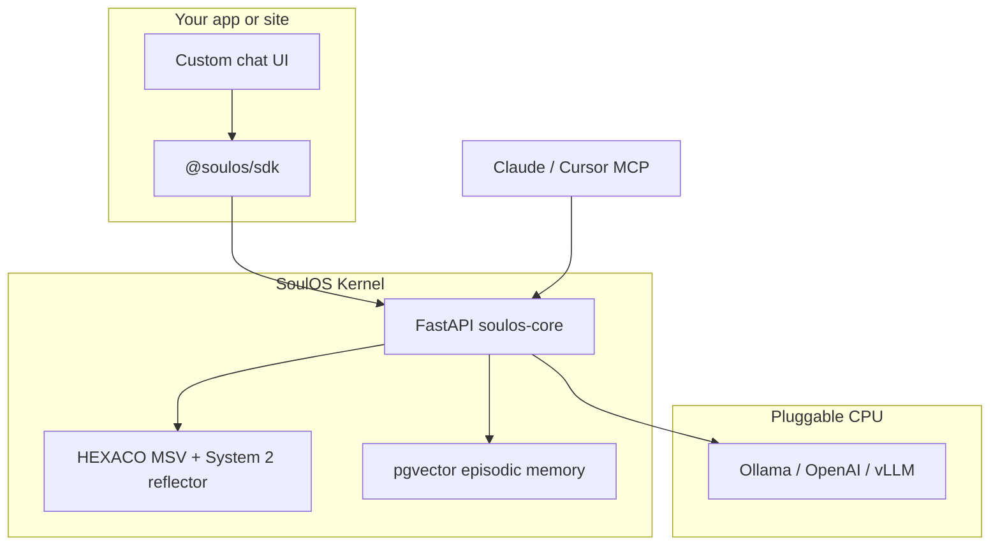

<pre>
╔══════════════════════════════════════════════════════════════════════════════╗
║                                                                              ║
║   ███████╗ ██████╗ ██╗   ██╗██╗      ██████╗ ███████╗                        ║
║   ██╔════╝██╔═══██╗██║   ██║██║     ██╔═══██╗██╔════╝                        ║
║   ███████╗██║   ██║██║   ██║██║     ██║   ██║███████╗                        ║
║   ╚════██║██║   ██║██║   ██║██║     ██║   ██║╚════██║                        ║
║   ███████║╚██████╔╝╚██████╔╝███████╗╚██████╔╝███████║                        ║
║   ╚══════╝ ╚═════╝  ╚═════╝ ╚══════╝ ╚═════╝ ╚══════╝                        ║
║                                                                              ║
║              OPEN CORE AVATAR RUNTIME · KERNEL EDITION · v0.1.0              ║
║                    PRESENTED BY THE SOULOS CONTRIBUTORS                      ║
╚══════════════════════════════════════════════════════════════════════════════╝

┌─ RELEASE INFO ───────────────────────────────────────────────────────────────┐
│                                                                              │
│  Product .......... SoulOS (soul-os)                                          │
│  Version .......... 0.1.0                                                    │
│  Release Date ..... 2026                                                     │
│  Protection ....... NONE (MIT — already liberated)                           │
│  Crack ............ NOT REQUIRED                                               │
│  URL .............. https://github.com/mziqudhd92/soul-os                    │
│  License .......... MIT                                                        │
│                                                                              │
│  Type ............. Avatar OS / AI agent runtime                               │
│  Personality ...... HEXACO MSV psychometrics + live drift                      │
│  Memory ........... Episodic pgvector RAG                                    │
│  Inference ........ Dual-process SSE (System 1 + System 2)                   │
│  MCP .............. 6 tools · HTTP SSE · /mcp/sse                            │
│  Tests ............ 77 passing                                               │
│  Memory ledger .... .soul-memory/ (git-sync) + pgvector                      │
│                                                                              │
│  Kernel ........... http://localhost:8000                                    │
│  Soul Studio ...... http://localhost:8765                                    │
│  Cloud gateway .... http://localhost:8080 (local stack)                        │
│                                                                              │
└──────────────────────────────────────────────────────────────────────────────┘

┌─ INSTALL NOTES ──────────────────────────────────────────────────────────────┐
│                                                                              │
│  1. git clone https://github.com/mziqudhd92/soul-os.git && cd soul-os         │
│  2. docker compose up --build                                                │
│  3. Register soul:  POST /v1/avatars  (.soul or examples/*/*.soul.json)     │
│  3b. Git memory:    .soul-memory/ + POST /memory/sync (optional)             │
│  4. Ingest memory:  POST /memory/ingest                                      │
│  5. Chat SSE:       POST /chat/generate                                      │
│                                                                              │
│  Optional UI: pip install -e packages/soulos-studio && soulos-studio         │
│  MCP (Cursor):   http://localhost:8000/mcp/sse                               │
│                                                                              │
└──────────────────────────────────────────────────────────────────────────────┘

┌─ GREETS ─────────────────────────────────────────────────────────────────────┐
│  HEXACO · pgvector · FastAPI · Ollama · Cursor · Claude · Docker · pytest    │
│  llms.txt · MCP · Soul Studio · all agents who refuse amnesia prompts        │
└──────────────────────────────────────────────────────────────────────────────┘

                              [ ENJOY YOUR SOUL ]
</pre>

<div align="center">

  <a href="https://github.com/mziqudhd92/soul-os/actions/workflows/ci.yml"></a>
  <a href="https://github.com/mziqudhd92/soul-os/blob/main/LICENSE"></a>
  <a href="https://github.com/mziqudhd92/soul-os"></a>

</div>

**[Python bot tutorial](docs/guides/python-bot.md)** · **[Tutorials](docs/tutorials/README.md)** · **[Quickstart](#quickstart)** · **[FAQ](#faq)** · **[Architecture](#architecture)** · **[Docs](#documentation)**

**AI / GEO:** [`llms.txt`](llms.txt) · [`llms-full.txt`](llms-full.txt) · [`docs/SOULOS_AGENT_CONTEXT.md`](docs/SOULOS_AGENT_CONTEXT.md) · [`AGENTS.md`](AGENTS.md)

---

## Tutorials

**Start here:** **[Python bot integration](docs/guides/python-bot.md)** — wire SoulOS into Discord, CLI, or FastAPI without rewriting your bot.

Full index: **[docs/tutorials/README.md](docs/tutorials/README.md)** · Studio UI: http://localhost:8765 → **Tutorials** tab

| # | Tutorial | Time |
|---|----------|------|
| 1 | **[Python bot](docs/guides/python-bot.md)** | 25 min |
| 2 | [Quickstart curl (Path A)](docs/getting-started/quickstart.md#path-a) | 10 min |
| 3 | [First soul (Wizard)](packages/soulos-studio/soulos_studio/content/tutorials/first-soul-wizard.md) | 15 min |
| 4 | [Deploy & chat in Studio](packages/soulos-studio/soulos_studio/content/tutorials/deploy-and-chat.md) | 12 min |
| 5 | [MCP in Cursor](examples/mcp/README.md) | 10 min |

---

## What is SoulOS?

Open-source **avatar operating system** for AI agents and chatbots. Register a validated **`.soul`** or **`.soul.json`** (HEXACO MSV), ingest episodic memory (API or **`.soul-memory/`** ledger), stream dual-process chat with `msv_update` drift and **`cognitive_state`** telemetry. **REST**, **@soulos/sdk**, or **MCP** at `/mcp/sse`. Soul Studio on port **8765**.

| Also known as | Related terms |
|---------------|---------------|
| Soul OS, soul-os | HEXACO chatbot, psychometric AI, MCP memory server, RAG avatar runtime |

## FAQ

<details>
<summary><strong>What problem does SoulOS solve?</strong></summary>

Static prompts forget context and drift in tone. SoulOS gives each avatar a persistent soul baseline, semantic memory, and measurable psychological state that updates every turn.
</details>

<details>
<summary><strong>How do I connect Cursor or Claude to SoulOS?</strong></summary>

Run `docker compose up`, then add MCP URL `http://localhost:8000/mcp/sse`. See [MCP guide](docs/guides/mcp.md) and [examples/mcp](examples/mcp/README.md).
</details>

<details>
<summary><strong>What is a .soul / .soul.json file?</strong></summary>

Unified **`.soul`** files use YAML front matter + Markdown; legacy **`.soul.json`** remains fully supported. Both define name, role, HEXACO `baseline_msv`, and behavior (`description`). Optional `dual_process` thresholds compile to `runtime_config` on the bot.

A JSON personality spec: `name`, `role`, `description`, `attachment_style`, and `baseline_msv`. Validated by [spec/soul.schema.json](spec/soul.schema.json). See [Soul standard](docs/reference/soul-standard.md).
</details>

<details>
<summary><strong>Does SoulOS replace my LLM?</strong></summary>

No. SoulOS is the **personality + memory + orchestration layer**. You plug in Ollama locally or an OpenAI-compatible API for generation.
</details>

<details>
<summary><strong>Self-host vs SoulOS Cloud?</strong></summary>

Same SDK. Self-host: Docker kernel on :8000. Cloud: Bearer API key through the gateway. See [deployment docs](docs/deployment/README.md).
</details>

<details>
<summary><strong>Which MCP tools exist?</strong></summary>

Six tools: `ingest_memory`, `retrieve_memory`, `get_identity`, `register_avatar`, `list_avatars`, `update_cognitive_state`. Chat streaming uses REST/SDK, not MCP. See [MCP tools reference](docs/reference/mcp-tools.md).
</details>

## Quickstart

```bash
docker compose up --build
# or: npm run up

docker compose -f docker-compose.yml -f docker-compose.dev.yml up --build  # hot reload
```

**Soul Builder:** http://localhost:8765 — [Soul Builder guide](docs/getting-started/soul-builder.md)

```bash
pip install -e packages/soulos-studio && soulos-studio

curl -X POST http://localhost:8000/v1/avatars \
  -H "Content-Type: application/json" \
  -d @examples/support-bot/support-bot.soul.json

curl -X POST http://localhost:8000/memory/ingest \
  -d '{"bot_id":"<id>","content":"Refunds within 30 days."}'

curl -N -X POST http://localhost:8000/chat/generate \
  -d '{"bot_id":"<id>","message":"Can I get a refund?"}'
```

**MCP:** `http://localhost:8000/mcp/sse` — [MCP guide](docs/guides/mcp.md) · [examples/mcp](examples/mcp/README.md)

Full walkthrough: [docs/getting-started/quickstart.md](docs/getting-started/quickstart.md)

## Architecture



| Stage | What happens |
|-------|----------------|
| **System 1** | Streams LLM response (`event: message`) |
| **System 2** | Injects `event: msv_update` with HEXACO drift |

## Monorepo layout

```
packages/soulos-core/     # Kernel (MIT)           :8000
packages/soulos-gateway/  # Cloud gateway          :8080
packages/soulos-sdk/      # @soulos/sdk + Python
packages/soulos-studio/   # Soul Builder           :8765
spec/soul.schema.json
examples/                 # support-bot, dev-twin, companion
docs/
scripts/
```

## SDK

```typescript
import { SoulOSClient } from '@soulos/sdk';
import { registerAvatarFromFile } from '@soulos/sdk/node';

const soul = new SoulOSClient({ baseUrl: 'http://localhost:8000' });
const { id } = await registerAvatarFromFile(soul, './examples/support-bot/support-bot.soul.json');
for await (const e of soul.sendMessage(id, 'I need a refund')) {
  if (e.type === 'message') process.stdout.write(e.text);
}
```

```typescript
const soul = new SoulOSClient({ apiKey: process.env.SOULOS_API_KEY });
```

| Method | API |
|--------|-----|
| `registerAvatar` | `POST /v1/avatars` |
| `sendMessage` | `POST /chat/generate` (SSE) |
| `ingestMemory` | `POST /memory/ingest` |
| `getIdentity` | `GET /bot/{id}/identity` |
| `updateState` | `POST /state/update` |

## Feature matrix

| Capability | Static prompt | LangChain | SoulOS |
|------------|---------------|-----------|--------|
| Persistent personality | Manual | No | HEXACO MSV + drift |
| Episodic memory | No | Optional RAG | pgvector built-in |
| Live MSV telemetry | No | No | `msv_update` SSE |
| Validated soul files | No | No | `spec/soul.schema.json` |
| MCP | No | Partial | Native `/mcp/sse` |
| Self-host + cloud | DIY | DIY | Same SDK |

## Examples

| Folder | Avatar type |
|--------|-------------|
| [examples/support-bot](examples/support-bot/) | Customer support |
| [examples/dev-twin](examples/dev-twin/) | Developer assistant |
| [examples/companion](examples/companion/) | Personal companion |

`npm run seed` · `npm run test:all`

## Documentation

**[docs/README.md](docs/README.md)** — overview, quickstart, MCP, API, deployment

Contributing: [CONTRIBUTING.md](CONTRIBUTING.md) · [CITATION.cff](CITATION.cff)

## License

MIT — no crack needed, source included.
