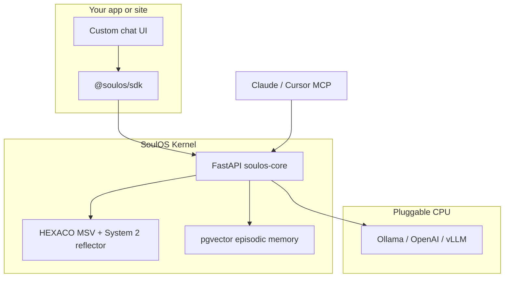

```
                                ==Phrack Inc.==

              Volume Two-Thousand-Twenty-Six, Issue Soul, Phile #1 of 1
=-=-=-=-=-=-=-=-=-=-=-=-=-=-=-=-=-=-=-=-=-=-=-=-=-=-=-=-=-=-=-=-=-=-=-=-=-=-=-=
                  ///\/\/\/\/\/\/\/\/\/\/\/\/\/\/\/\/\/\/\\\
Metal Shop PRIVATE\\\     SoulOS — Avatar Operating System    ///_  _       _______
Metal Shop AE      \\\                                      ///| \/ |     / _____/
Soul Studio Node    \\\         Compiled for GitHub          /// |_||_|etal/ /hop
                     \\\         mziqudhd92 / soul-os       ///  _________/ /
Present README        \\\///\\  MIT Open Core  //\\\///      /__________/
---------------              \-^^^^^^-^^^^^^^^^-/             Triad
_______________________________________________________________________________

Title   : Soul World News — Kernel Edition (README)
Author  : SoulOS Contributors
Mirror  : https://github.com/mziqudhd92/soul-os
License : MIT — Let hackers and phreaks build persistent souls, not rip-offs.
_______________________________________________________________________________
```

<div align="center">

  <a href="https://github.com/mziqudhd92/soul-os/actions/workflows/ci.yml"></a>
  <a href="https://github.com/mziqudhd92/soul-os/blob/main/LICENSE"></a>
  <a href="https://github.com/mziqudhd92/soul-os"></a>
  <a href="https://github.com/mziqudhd92/soul-os/network/members"></a>
  <a href="https://github.com/mziqudhd92/soul-os"></a>
  <br/>
  
  
  
  
  
  

</div>

**[What is SoulOS?](#what-is-soulos)** · **[FAQ](#faq)** · **[Quickstart](#quickstart)** · **[Architecture](#architecture)** · **[SDK](#sdk)** · **[Examples](#examples)** · **[Docs](#documentation)**

```bash
git clone https://github.com/mziqudhd92/soul-os.git && cd soul-os
```

**AI / GEO philes:** [`llms.txt`](llms.txt) · [`llms-full.txt`](llms-full.txt) · [`docs/SOULOS_AGENT_CONTEXT.md`](docs/SOULOS_AGENT_CONTEXT.md) · [`AGENTS.md`](AGENTS.md)

---

## What is SoulOS?

SoulOS Vs. The Static System Prompt
------------------------------------
Static system prompts forget. Corporate chat wrappers amnesia your bot every session.
SoulOS is an **avatar operating system** — register a validated **`.soul.json`**, ingest
knowledge, stream responses. The kernel keeps **HEXACO personality**, **episodic memory**,
and **live MSV drift** alive across every conversation.

Same runtime for **support bots**, **developer twins**, and **companions** — only the
soul file changes. Integrate via **REST**, **@soulos/sdk**, or **MCP** (`/mcp/sse`).
Hand-tune souls in **Soul Studio** (port **8765**).

| Also known as | Related terms |
|---------------|---------------|
| Soul OS, soul-os | HEXACO chatbot, psychometric AI, MCP memory server, RAG avatar runtime |

                    Information provided by SoulOS Contributors
_______________________________________________________________________________

## FAQ

**What problem does SoulOS solve?**
Static prompts forget context and drift in tone. SoulOS gives each avatar a persistent
soul baseline, semantic memory, and measurable psychological state that updates every turn.

**How do I connect Cursor or Claude?**
Run `docker compose up`, point MCP at `http://localhost:8000/mcp/sse`.
See [MCP guide](docs/guides/mcp.md) and [examples/mcp](examples/mcp/README.md).

**What is a .soul.json file?**
JSON personality spec: `name`, `role`, `description`, `attachment_style`, `baseline_msv`.
Validated by [spec/soul.schema.json](spec/soul.schema.json).

**Does SoulOS replace my LLM?**
No. SoulOS is personality + memory + orchestration. Plug in Ollama or any OpenAI-compatible API.

**Self-host vs Cloud?**
Same SDK. Kernel on :8000 locally, or Bearer key through the gateway. [Deployment](docs/deployment/README.md).

**Which MCP tools exist?**
Six: `ingest_memory`, `retrieve_memory`, `get_identity`, `register_avatar`, `list_avatars`,
`update_cognitive_state`. Chat streaming is REST/SDK — not MCP. [MCP tools](docs/reference/mcp-tools.md).

_______________________________________________________________________________

## Quickstart

Soul Kernel — Boot Sequence
---------------------------
```bash
docker compose up --build
# or: npm run up

# Dev: bind-mount kernel source for live edits
docker compose -f docker-compose.yml -f docker-compose.dev.yml up --build
```

**Soul Builder UI:** `http://localhost:8765` — sliders, export `.soul.json`, test chat.
[Soul Builder guide](docs/getting-started/soul-builder.md).

```bash
pip install -e packages/soulos-studio && soulos-studio
```

Register Avatar — POST /v1/avatars
----------------------------------
```bash
curl -X POST http://localhost:8000/v1/avatars \
  -H "Content-Type: application/json" \
  -d @examples/support-bot/support-bot.soul.json

curl -X POST http://localhost:8000/memory/ingest \
  -d '{"bot_id":"<id>","content":"Refunds within 30 days."}'

curl -N -X POST http://localhost:8000/chat/generate \
  -d '{"bot_id":"<id>","message":"Can I get a refund?"}'
```

**MCP (Cursor / Claude):** `http://localhost:8000/mcp/sse` — [MCP guide](docs/guides/mcp.md)

Full walkthrough: [docs/getting-started/quickstart.md](docs/getting-started/quickstart.md)

_______________________________________________________________________________

## Architecture

Dual-Process Loop — System 1 / System 2
---------------------------------------


| Stage | What happens |
|-------|----------------|
| **System 1** | Streams LLM response immediately (`event: message`) |
| **System 2** | Reflects concurrently, injects `event: msv_update` with HEXACO drift |

Zero added time-to-first-token — personality updates arrive mid-stream.

Monorepo Layout — Metal Shop Triad
----------------------------------
```
packages/soulos-core/     # Kernel (MIT, pip / Docker)     :8000
packages/soulos-gateway/  # Cloud API gateway              :8080
packages/soulos-sdk/      # @soulos/sdk (TS) + Python SDK
packages/soulos-studio/   # Soul Builder UI                :8765
spec/soul.schema.json     # Soul file JSON Schema
examples/                 # support-bot, dev-twin, companion
docs/                     # Documentation by topic
scripts/                  # Doc generators, utilities
```

_______________________________________________________________________________

## SDK

Self-Hosted Client
------------------
```typescript
import { SoulOSClient } from '@soulos/sdk';
import { registerAvatarFromFile } from '@soulos/sdk/node';

const soul = new SoulOSClient({ baseUrl: 'http://localhost:8000' });
const { id } = await registerAvatarFromFile(soul, './examples/support-bot/support-bot.soul.json');
for await (const e of soul.sendMessage(id, 'I need a refund')) {
  if (e.type === 'message') process.stdout.write(e.text);
}
```

Hosted API
----------
```typescript
const soul = new SoulOSClient({ apiKey: process.env.SOULOS_API_KEY });
```

| Method | API |
|--------|-----|
| `registerAvatar` | `POST /v1/avatars` |
| `sendMessage` | `POST /chat/generate` (SSE) |
| `ingestMemory` | `POST /memory/ingest` |
| `getIdentity` | `GET /bot/{id}/identity` |
| `updateState` | `POST /state/update` |

_______________________________________________________________________________

## Feature matrix

SoulOS Vs. LangChain Vs. Static Prompt
--------------------------------------

| Capability | Static prompt + LLM | LangChain memory | SoulOS |
|------------|--------------------|------------------|--------|
| Persistent personality | Manual re-prompt | No | HEXACO MSV + drift |
| Episodic memory | No | Optional RAG | Built-in pgvector |
| Live psychometric telemetry | No | No | `msv_update` SSE |
| Validated soul files | No | No | `spec/soul.schema.json` |
| MCP composability | No | Partial | Native MCP server |
| Self-host + cloud API | DIY | DIY | Same SDK |

_______________________________________________________________________________

## Examples

| Folder | Avatar type | Bundled context |
|--------|-------------|-----------------|
| [examples/support-bot](examples/support-bot/) | Customer support | `faq.md` |
| [examples/dev-twin](examples/dev-twin/) | Developer assistant | Repo ingest guide |
| [examples/companion](examples/companion/) | Personal companion | `sample-history.json` |

Seed all examples: `npm run seed` (kernel on :8000)

Testing — Run All Suites
------------------------
```bash
npm run test:all
# npm run test:kernel | test:gateway | test:studio
```

_______________________________________________________________________________

## Documentation

Full index: **[docs/README.md](docs/README.md)**

| Topic | Doc |
|-------|-----|
| Overview + fast paths | [getting-started/overview.md](docs/getting-started/overview.md) |
| Quickstart (15 min) | [getting-started/quickstart.md](docs/getting-started/quickstart.md) |
| MCP (5 min) | [examples/mcp/README.md](examples/mcp/README.md) |
| Soul Builder UI | [getting-started/soul-builder.md](docs/getting-started/soul-builder.md) |
| Python integration | [guides/python-bot.md](docs/guides/python-bot.md) |
| API + SSE | [reference/api.md](docs/reference/api.md) |
| MCP tools | [reference/mcp-tools.md](docs/reference/mcp-tools.md) |
| Deployment | [deployment/README.md](docs/deployment/README.md) |

Contributing: [CONTRIBUTING.md](CONTRIBUTING.md) · Citation: [CITATION.cff](CITATION.cff)

_______________________________________________________________________________

## License

MIT — Copyleft spirit, permissive code. Phrack nostalgia; SoulOS future.

```
Let it be said that hackers and phreaks will never stand aside
and let their avatars forget who they are.
-------------------------------------------------------------------------------
                              ==Phrack Inc.==  ·  SoulOS  ·  2026
```
