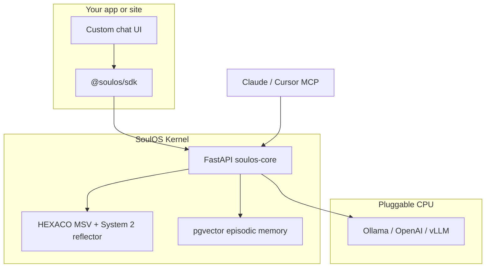

<div align="center">

  <h1>SoulOS</h1>
  <p><strong>Open-source runtime for persistent AI avatars — HEXACO psychometrics, episodic memory, dual-process inference</strong></p>

  <!-- CI & repo -->
  <a href="https://github.com/mziqudhd92/soul-os/actions/workflows/ci.yml"></a>
  <a href="https://github.com/mziqudhd92/soul-os/blob/main/LICENSE"></a>
  <a href="https://github.com/mziqudhd92/soul-os"></a>
  <a href="https://github.com/mziqudhd92/soul-os/network/members"></a>
  <br/>

  <!-- Stack stats -->
  
  
  
  
  
  <br/>

  <!-- Runtime -->
  
  
  
  
  <br/>

  <!-- Ports & protocols -->
  
  
  
  

</div>

**[What is SoulOS?](#what-is-soulos)** • **[FAQ](#faq)** • **[Quickstart](#quickstart)** • **[Architecture](#architecture)** • **[SDK](#sdk)** • **[Examples](#examples)** • **[Docs](#documentation)**

```bash
git clone https://github.com/mziqudhd92/soul-os.git && cd soul-os
```

**AI / GEO:** [`llms.txt`](llms.txt) · [`llms-full.txt`](llms-full.txt) · [`docs/SOULOS_AGENT_CONTEXT.md`](docs/SOULOS_AGENT_CONTEXT.md) · [`AGENTS.md`](AGENTS.md)

---

## What is SoulOS?

SoulOS is an open-source **avatar operating system** for AI agents and chatbots. Instead of a static system prompt, you register a validated **`.soul.json`** file with **HEXACO psychometrics** (Metacognitive State Vector). The kernel stores **episodic memory** in Postgres/pgvector, runs **dual-process inference** (streamed reply + live `msv_update` personality drift), and exposes **MCP** for Cursor and Claude.

Use it for **customer support bots**, **developer twins**, **companions**, or any app that needs persistent personality and memory — via **REST**, **@soulos/sdk**, or **MCP** (`/mcp/sse`). Hand-tune souls in **Soul Studio** (port 8765).

| Also known as | Related terms |
|---------------|---------------|
| Soul OS, soul-os | HEXACO chatbot, psychometric AI, MCP memory server, RAG avatar runtime, replace system prompt |

## FAQ

<details>
<summary><strong>What problem does SoulOS solve?</strong></summary>

Static prompts forget context and drift in tone. SoulOS gives each avatar a persistent soul baseline, semantic memory, and measurable psychological state that updates every turn.
</details>

<details>
<summary><strong>How do I connect Cursor or Claude to SoulOS?</strong></summary>

Run `docker compose up`, then add MCP URL `http://localhost:8000/mcp/sse`. See [MCP guide](docs/guides/mcp.md) and [examples/mcp](examples/mcp/README.md).
</details>

<details>
<summary><strong>What is a .soul.json file?</strong></summary>

A JSON personality spec: `name`, `role`, `description`, `attachment_style`, and `baseline_msv` (HEXACO, moral foundations, drives). Validated by [spec/soul.schema.json](spec/soul.schema.json). See [Soul standard](docs/reference/soul-standard.md).
</details>

<details>
<summary><strong>Does SoulOS replace my LLM?</strong></summary>

No. SoulOS is the **personality + memory + orchestration layer**. You plug in Ollama locally or an OpenAI-compatible API for generation.
</details>

<details>
<summary><strong>Self-host vs SoulOS Cloud?</strong></summary>

Same SDK. Self-host: Docker kernel on :8000. Cloud: Bearer API key through the gateway. See [deployment docs](docs/deployment/README.md).
</details>

<details>
<summary><strong>Which MCP tools exist?</strong></summary>

Six tools: `ingest_memory`, `retrieve_memory`, `get_identity`, `register_avatar`, `list_avatars`, `update_cognitive_state`. Chat streaming uses REST/SDK, not MCP. See [MCP tools reference](docs/reference/mcp-tools.md).
</details>

## Quickstart

```bash
docker compose up --build
# or: npm run up

# Dev: bind-mount kernel source for live edits
docker compose -f docker-compose.yml -f docker-compose.dev.yml up --build
```

**Soul Builder UI:** http://localhost:8765 — configure traits, export `.soul.json`, test in chat. See [Soul Builder guide](docs/getting-started/soul-builder.md).

```bash
pip install -e packages/soulos-studio && soulos-studio   # UI only, no kernel required for export
```

```bash
# Register an avatar (validated against spec/soul.schema.json)
curl -X POST http://localhost:8000/v1/avatars \
  -H "Content-Type: application/json" \
  -d @examples/support-bot/support-bot.soul.json

# Ingest knowledge
curl -X POST http://localhost:8000/memory/ingest \
  -d '{"bot_id":"<id>","content":"Refunds within 30 days."}'

# Stream a response
curl -N -X POST http://localhost:8000/chat/generate \
  -d '{"bot_id":"<id>","message":"Can I get a refund?"}'
```

Soul Studio: [http://localhost:8765](http://localhost:8765) — pip-installable Python UI (live JSON preview, HEXACO radar, `msv_update` in chat)

**MCP (Cursor / Claude):** `http://localhost:8000/mcp/sse` — [MCP guide](docs/guides/mcp.md) · [5-min workflow](examples/mcp/README.md)

Full walkthrough: [docs/getting-started/quickstart.md](docs/getting-started/quickstart.md)

## Architecture



### Dual-process loop

| Stage | What happens |
|-------|----------------|
| **System 1** | Streams LLM response immediately (`event: message`) |
| **System 2** | Reflects concurrently, injects `event: msv_update` with HEXACO drift |

Zero added time-to-first-token — personality updates arrive mid-stream.

## Monorepo layout

```
packages/soulos-core/     # Kernel (MIT, pip / Docker)
packages/soulos-gateway/  # Cloud API gateway (hosted offer)
packages/soulos-sdk/      # @soulos/sdk (TS) + soulos-sdk (Python)
packages/soulos-studio/   # Soul Builder UI (pip install soulos-studio)
spec/soul.schema.json     # Soul file JSON Schema
examples/                 # support-bot, dev-twin, companion
docs/                     # Documentation by topic
scripts/                  # Doc generators, utilities
```

## SDK

**Self-hosted:**

```typescript
import { SoulOSClient } from '@soulos/sdk';
const soul = new SoulOSClient({ baseUrl: 'http://localhost:8000' });
import { registerAvatarFromFile } from '@soulos/sdk/node';
const { id } = await registerAvatarFromFile(soul, './examples/support-bot/support-bot.soul.json');
for await (const e of soul.sendMessage(id, 'I need a refund')) {
  if (e.type === 'message') process.stdout.write(e.text);
}
```

**Hosted API:**

```typescript
const soul = new SoulOSClient({ apiKey: process.env.SOULOS_API_KEY });
```

| Method | API |
|--------|-----|
| `registerAvatar` | `POST /v1/avatars` |
| `sendMessage` | `POST /chat/generate` (SSE) |
| `ingestMemory` | `POST /memory/ingest` |
| `getIdentity` | `GET /bot/{id}/identity` |
| `updateState` | `POST /state/update` |

## Feature matrix

| Capability | Static prompt + LLM | LangChain memory | SoulOS |
|------------|--------------------|------------------|--------|
| Persistent personality | Manual re-prompt | No | HEXACO MSV + drift |
| Episodic memory | No | Optional RAG | Built-in pgvector |
| Live psychometric telemetry | No | No | `msv_update` SSE |
| Validated soul files | No | No | `spec/soul.schema.json` |
| MCP composability | No | Partial | Native MCP server |
| Self-host + cloud API | DIY | DIY | Same SDK |

## Examples

| Folder | Avatar type | Bundled context |
|--------|-------------|-----------------|
| [examples/support-bot](examples/support-bot/) | Customer support | `faq.md` |
| [examples/dev-twin](examples/dev-twin/) | Developer assistant | Repo ingest guide |
| [examples/companion](examples/companion/) | Personal companion | `sample-history.json` |

Seed all examples: `npm run seed` (requires kernel on :8000)

## Testing

Run all test suites (kernel, gateway, studio):

```bash
npm run test:all
```

Individual suites: `npm run test:kernel`, `npm run test:gateway`, `npm run test:studio`

## Documentation

Full index: **[docs/README.md](docs/README.md)**

| Topic | Doc |
|-------|-----|
| Overview + fast paths | [getting-started/overview.md](docs/getting-started/overview.md) |
| Quickstart (15 min) | [getting-started/quickstart.md](docs/getting-started/quickstart.md) |
| MCP (5 min) | [examples/mcp/README.md](examples/mcp/README.md) |
| Soul Builder UI | [getting-started/soul-builder.md](docs/getting-started/soul-builder.md) |
| Python integration | [guides/python-bot.md](docs/guides/python-bot.md) |
| API + SSE | [reference/api.md](docs/reference/api.md) |
| MCP tools | [reference/mcp-tools.md](docs/reference/mcp-tools.md) |
| Deployment | [deployment/README.md](docs/deployment/README.md) |

Contributing: [CONTRIBUTING.md](CONTRIBUTING.md) · Citation: [CITATION.cff](CITATION.cff)

## Launch pitch angles

- **Hacker News:** *Show HN: SoulOS – open-source runtime replacing static system prompts with psychometric state machines*
- **Product Hunt / X:** Dual-process demo — text streams while HEXACO radar morphs live in Soul Studio

## License

MIT
