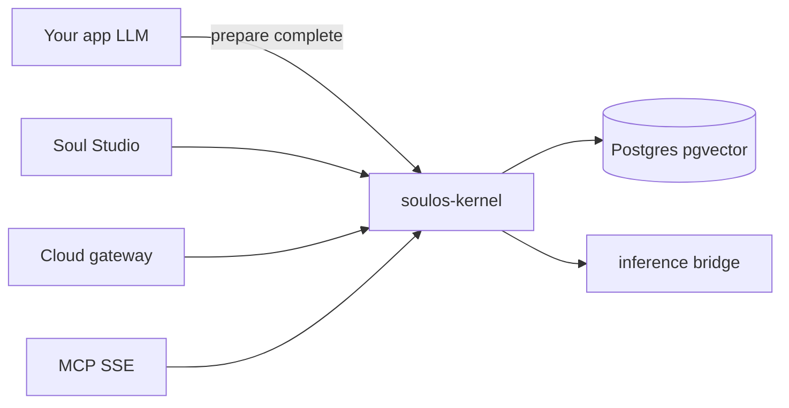

# Architecture overview (contributors)

SoulOS is an **identity + episodic memory sidecar** for agents you already run — not a full agent OS, chat UI, or webhook platform.

## Packages

| Path | Role |
|------|------|
| `packages/soulos-core/` | Kernel (FastAPI): avatars, hybrid, memory, MCP |
| `packages/soulos-sdk/python/` | Python `SoulHybridClient` + handoff helpers |
| `packages/soulos-sdk/ts/` | `@soulos/sdk` TypeScript client |
| `packages/soulos-studio/` | Soul Studio (FastAPI + static UI) |
| `packages/soulos-gateway/` | Cloud API key gateway |
| `packages/soulos-inference-bridge/` | Embeddings / chat backends |
| `packs/soulpacks/` | First-party MIT SoulPacks |

## Primary integration

`ensure_avatar` → `POST /hybrid/prepare` → **your LLM** → `POST /hybrid/complete`

Python and TypeScript SDKs both exist. Prefer Python for AI/ML workflows; OpenAPI at `docs/reference/openapi.kernel.json` is the contract.

## Observability

Opt-in OpenTelemetry on hybrid prepare/complete (spans + duration metrics). See [observability.md](observability.md).

## Scale assumptions

Avatar and memory state live in Postgres (horizontally scalable kernel pods). See [horizontal-scale.md](horizontal-scale.md).

## Explicit non-goals (near term)

See [non-goals.md](../design/non-goals.md) — no public persona registry, no Kafka mesh, no multi-vector SPI, no in-kernel PII scrubber.

## Deeper reference

- [architecture.md](../reference/architecture.md) — pipeline modules and data models
- [identity-model.md](identity-model.md) — `external_key`, `session_id`, tenants
- [multi-agent-teams.md](multi-agent-teams.md) — Phase A handoffs
