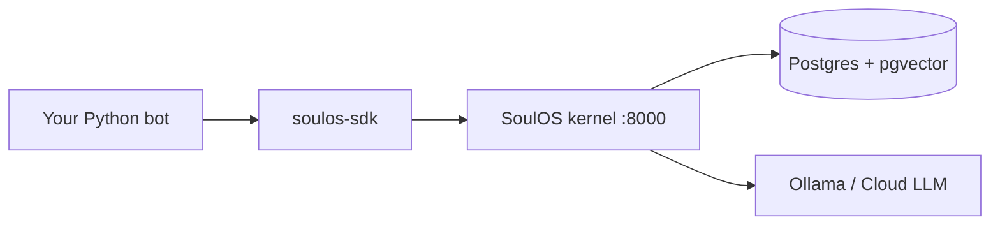

# Tutorial: Add SoulOS to Your Python Bot

> **Interactive tutorial (recommended):** open Soul Studio → **Tutorials** → **Python bot integration** for step-by-step animations, kernel health check, and SSE playground.  
> **Studio URL:** http://localhost:8765 → Tutorials tab

> **Start here** — recommended first tutorial for human developers building real bots.

You already have a Python bot — a script, Discord/Telegram handler, or FastAPI app that calls an LLM with a fixed `system` prompt. This guide plugs in **SoulOS** for **persistent personality** and **stable behavior** without rewriting your transport layer.

SoulOS does **not** replace webhooks, CLI, or Slack SDK. It replaces the fragile part: *one big system prompt + hope the model remembers.*

**Time:** ~25 minutes · **Outcome:** working REPL (or pattern you can paste into Discord/FastAPI)

<details open>
<summary><strong>Quick path (interactive)</strong></summary>

1. `docker compose up --build`
2. Open http://localhost:8765 → **Tutorials** → **Python bot integration**
3. Follow the 6-step rail (copy code, check kernel, run SSE demo)
4. Open **Soul Builder** from step 2 to export your `.soul`

</details>

## Learning objectives

By the end you will:

1. Map your system prompt → `.soul` or `.soul.json` + episodic memory
2. Register once, persist `avatar_id`, chat via `send_message`
3. Handle `msv_update` and `cognitive_state` for uncertainty / escalation signals
4. Know when to re-register vs when memory alone is enough

---

## What you gain

| Without SoulOS | With SoulOS |
|----------------|-------------|
| Personality in a static system prompt | **Soul file** (`baseline_msv`) — validated HEXACO psychometrics |
| Context stuffed into prompt manually | **Episodic memory** — pgvector recall per message |
| Tone drifts across sessions | **MSV drift** — `current_msv` updates after each turn (System 2) |
| You parse “be friendly” into prompts | Kernel injects state + recalled facts into generation |

**Stability** here means: same avatar id → same soul baseline, remembered facts, and traceable state changes — not identical wording every time (real personalities adapt).

---

## Architecture (keep your bot, add a kernel)



<details>
<summary><strong>ASCII diagram</strong></summary>

```text
Your Python bot (Discord / CLI / FastAPI)
        │
        │  soulos-sdk (HTTP)
        ▼
SoulOS kernel (:8000)  — personality + memory + dual-process chat
        │
        ▼
Postgres (pgvector) + your LLM provider (Ollama locally, or Cloud)
```

</details>

Your bot still receives user messages and sends replies. SoulOS becomes the **brain** for *who the bot is* and *what it remembers*.

---

## Prerequisites

1. **Python 3.12+**
2. **SoulOS kernel running** (self-host):

```bash
cd soulos   # your clone of this repo
docker compose up --build
# Kernel: http://localhost:8000
```

3. Install the Python client from this monorepo:

```bash
pip install httpx
pip install -e packages/soulos-sdk/python
```

---

## Step 1 — Turn your system prompt into a soul file

**Easiest path:** use the local **Soul Builder** UI — no hand-editing JSON.

```bash
docker compose up --build   # or: npm run up
# Open http://localhost:8765 → tune sliders → Export JSON or Export .soul
```

See [Soul Builder guide](../getting-started/soul-builder.md).

**Manual path:** create `my-bot.soul` (recommended) or `my-bot.soul.json`.

**`.soul` example** (see `examples/support-bot/support-bot.soul`):

```markdown
---
name: Acme Support
role: Customer Support Agent
attachment_style: Secure
psychology:
  hexaco:
    honesty_humility: 0.9
    emotionality: 0.4
    extraversion: 0.5
    agreeableness: 0.9
    conscientiousness: 0.85
    openness: 0.5
  moral_foundations:
    care_harm: 0.95
    fairness_cheating: 0.9
  drives:
    curiosity: 0.5
    social_approval: 0.8
  epistemic_uncertainty: 0.15
  inner_monologue: Ready to help with clarity and fairness.
---

You help users with orders, refunds, and product questions. Be concise and empathetic. Escalate when policy is unclear.
```

**`.soul.json` example** if your bot today looks like this:

```python
SYSTEM = """
You are a helpful support agent for Acme Shop.
Be polite, honest, and escalate billing disputes you cannot resolve.
"""
```

Create `my-bot.soul.json`:

```json
{
  "name": "Acme Support",
  "role": "Customer Support Agent",
  "description": "You help users with orders, refunds, and product questions. Be concise and empathetic. Escalate when policy is unclear.",
  "attachment_style": "Secure",
  "baseline_msv": {
    "hexaco": { "H": 0.9, "E": 0.4, "X": 0.5, "A": 0.9, "C": 0.85, "O": 0.5 },
    "moral_foundations": {
      "care_harm": 0.95,
      "fairness_cheating": 0.9,
      "loyalty_betrayal": 0.7,
      "authority_subversion": 0.5,
      "sanctity_degradation": 0.4
    },
    "drives": { "curiosity": 0.5, "autonomy": 0.3, "social_approval": 0.8 },
    "epistemic_uncertainty": 0.15,
    "inner_monologue": "Ready to help with clarity and fairness."
  }
}
```

- **`description`** ≈ your old system prompt (behavior rules).
- **`baseline_msv`** ≈ personality knobs (honesty, warmth, structure). See [Psychometric cheat sheet](psychometrics.md).

You can start from `examples/support-bot/support-bot.soul` or `support-bot.soul.json` and edit names/traits.

---

## Step 2 — Register the avatar (once per deployment)

```python
import asyncio
from soulos.client import SoulOSClient

SOUL_PATH = "my-bot.soul"  # or my-bot.soul.json
KERNEL_URL = "http://localhost:8000"

async def bootstrap():
    soul = SoulOSClient(base_url=KERNEL_URL)
    avatar = await soul.register_avatar(SOUL_PATH)
    avatar_id = avatar["id"]
    print(f"Registered avatar: {avatar_id}")
    # Persist this id (env var, config file, DB) — reuse across restarts
    return avatar_id

if __name__ == "__main__":
    asyncio.run(bootstrap())
```

The SDK sends `.soul` files as raw body with `X-Filename`; JSON souls use `application/json`.

Save `avatar_id` somewhere durable. Registration creates a row in Postgres with `baseline_msv`, `current_msv`, and optional `runtime_config` (from `dual_process` in `.soul` front matter).

---

## Step 3 — Ingest what your bot should “know”

**Option A — kernel API** (good for scripts and one-off seeding):

```python
async def seed_knowledge(soul: SoulOSClient, avatar_id: str):
    facts = [
        "Full refunds within 30 days of purchase.",
        "Subscriptions renew on the 1st; cancel anytime before renewal.",
        "Escalate to humans for chargebacks over $500.",
    ]
    for fact in facts:
        await soul.ingest_memory(avatar_id, fact)
```

You can also ingest from files:

```python
from pathlib import Path

for line in Path("faq.txt").read_text().splitlines():
    line = line.strip()
    if line:
        await soul.ingest_memory(avatar_id, line)
```

On each chat, the kernel **recalls** relevant chunks automatically — you do not need to paste them into every request.

**Option B — git-backed `.soul-memory/`** (good for team repos):

```bash
# From repo root (after pip install -e packages/soulos-core)
soulos memory-append "Full refunds within 30 days of purchase."
soulos memory-sync "$SOULOS_AVATAR_ID" --workspace .
```

Commit `.soul-memory/` to git. After clone, run `sync_memory` so pgvector matches the ledger. Secrets matching `.soulignore` patterns are blocked from append. See [Soul standard](../reference/soul-standard.md#4-git-backed-episodic-memory-soul-memory).

```python
await soul.sync_memory(avatar_id, "/path/to/project")
```

---

## Step 4 — Replace your LLM call with `send_message`

### Before (typical basic bot)

```python
def chat(user_text: str) -> str:
    response = openai_client.chat.completions.create(
        model="gpt-4",
        messages=[
            {"role": "system", "content": SYSTEM},
            {"role": "user", "content": user_text},
        ],
    )
    return response.choices[0].message.content
```

### After (SoulOS-backed)

```python
import asyncio
from soulos.client import SoulOSClient

soul = SoulOSClient(base_url="http://localhost:8000")
AVATAR_ID = "your-persisted-avatar-id"


async def chat(user_text: str) -> str:
    parts: list[str] = []
    async for event in soul.send_message(AVATAR_ID, user_text):
        if event["type"] == "message":
            parts.append(event["text"])
        elif event["type"] == "msv_update":
            # Optional: log personality shift for debugging / moderation
            msv = event["msv"]
            uncertainty = msv.get("epistemic_uncertainty")
            if uncertainty and uncertainty > 0.7:
                print(f"[soul] high uncertainty: {uncertainty}")
        elif event["type"] == "cognitive_state":
            state = event["state"]
            s1 = state.get("system_1") or {}
            if s1.get("confidence_score", 1) < 0.35:
                print(f"[soul] System 2 deliberation: {state.get('current_path')}")
    return "".join(parts)


def chat_sync(user_text: str) -> str:
    return asyncio.run(chat(user_text))
```

1. **Recalls** episodic memory for the user message.
2. **Streams** the reply (`event: message`).
3. **Emits** `event: cognitive_state` telemetry (System 1 confidence vs System 2 loops).
4. **Reflects** in parallel and may emit `event: msv_update` with updated HEXACO / `inner_monologue`.

---

## Step 5 — Wire into your existing loop

### Simple REPL

Example: simple REPL (same pattern for Discord `on_message`, etc.):

```python
import asyncio
from soulos.client import SoulOSClient

AVATAR_ID = "your-persisted-avatar-id"
soul = SoulOSClient(base_url="http://localhost:8000")


async def handle_user_message(text: str) -> str:
    reply = []
    async for event in soul.send_message(AVATAR_ID, text):
        if event["type"] == "message":
            reply.append(event["text"])
    return "".join(reply)


async def main():
    print("Acme Support (SoulOS). Type 'quit' to exit.")
    while True:
        user = input("You: ").strip()
        if user.lower() in {"quit", "exit"}:
            break
        answer = await handle_user_message(user)
        print(f"Bot: {answer}\n")


if __name__ == "__main__":
    asyncio.run(main())
```

**Integration rule:** wherever you called your LLM before, call `handle_user_message` instead. Keep your auth, rate limits, and UI as they are.

### Discord-shaped handler (sketch)

```python
# discord.py-style — call SoulOS inside on_message
async def on_message(message):
    if message.author.bot:
        return
    text = await handle_user_message(message.content)
    await message.channel.send(text)
```

Register `avatar_id` once at bot startup (or read from env). Do **not** register on every message.

### FastAPI-shaped handler (sketch)

```python
@app.post("/chat")
async def chat_endpoint(body: dict):
    user_text = body["message"]
    return {"reply": await handle_user_message(user_text)}
```

Run SoulOS client once at app startup; reuse the same `SoulOSClient` and `avatar_id` per worker.

---

## Optional — Persist avatar id in environment

```bash
export SOULOS_KERNEL_URL=http://localhost:8000
export SOULOS_AVATAR_ID=<id-from-register>
```

```python
import os
from soulos.client import SoulOSClient

soul = SoulOSClient(base_url=os.environ["SOULOS_KERNEL_URL"])
avatar_id = os.environ["SOULOS_AVATAR_ID"]
```

Re-register only when you change the soul **baseline** (new personality). Day-to-day memory and drift live in the kernel DB.

---

## Hosted API (no local Docker)

Same code — swap client config:

```python
soul = SoulOSClient(api_key=os.environ["SOULOS_API_KEY"])
# Uses https://api.soulos.dev by default
```

See [SoulOS Cloud](../deployment/cloud.md) and [Self-hosted deployment](../deployment/self-hosted.md).

---

## Tips for personality stability

1. **Keep `description` short and policy-focused** — long prompts belong in ingested memory, not the soul file.
2. **Tune HEXACO slowly** — large baseline changes have more effect than hoping the model “stays nice.”
3. **Watch `epistemic_uncertainty`** in `msv_update` — high values are a good signal to escalate to a human in support bots.
4. **Ingest once, chat many times** — policies in memory stay consistent; the model does not rely on you re-pasting them.
5. **One avatar per bot persona** — dev twin and support bot should be separate registrations with different soul files.

---

## Troubleshooting

| Issue | Fix |
|-------|-----|
| `Connection refused` on :8000 | Run `docker compose up` or check `SOULOS_KERNEL_URL` |
| Empty or generic replies | Ingest domain facts; kernel needs memory + inference (Ollama) healthy |
| `Soul validation failed` | Soul JSON must match `spec/soul.schema.json` (HEXACO keys, trait ranges) |
| Slow first message | Ollama pulls models on kernel startup — wait for health on `/health` |

---

## Next steps

- [Quickstart](../getting-started/quickstart.md) — curl + TS SDK same runtime
- [Soul standard](../reference/soul-standard.md) — full `.soul.json` anatomy
- [API reference](../reference/api.md) — REST + SSE events
- [MCP integration](mcp.md) — use the same avatar from Claude/Cursor
