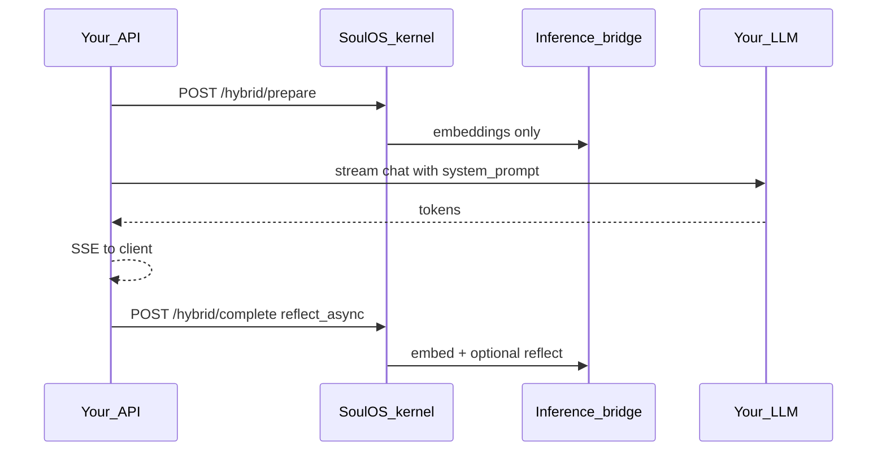

# Integrating SoulOS as a sidecar

Use this guide when your app **already has** an LLM (Bedrock, OpenAI, Vertex, LiteLLM) and custom SSE. SoulOS runs beside your API as a **sidecar** for soul + episodic memory + MSV reflection.

**Not for you if:** you want SoulOS to stream chat end-to-end → use [full chat mode](plug-in-soulos.md) (`POST /chat/generate`).

## Architecture



Your LLM handles **generation**. SoulOS handles **identity, RAG memory, MSV** via a separate inference plug-in (Ollama or [inference bridge](../deployment/inference.md)).

## Quick start

1. **Stack** — copy [docker-compose.sidecar.yml](../../docker-compose.sidecar.yml) or add as git submodule:

```bash
docker compose -f docker-compose.sidecar.yml --profile bridge-mock up
```

2. **Client** — Python or TypeScript:

```python
from soulos import SoulHybridClient

soul = SoulHybridClient(base_url="http://localhost:8001")
record = await soul.ensure_avatar("workspace:abc", "my-bot.soul.json")
ctx = await soul.prepare_turn("user question", session_id="session-1")
system_prompt = ctx["system_prompt"]
# ... your LLM stream ...
await soul.complete_turn("summary", user_message="...", session_id="session-1")
```

```typescript
import { SoulHybridClient } from "@soulos/sdk";

const soul = new SoulHybridClient({ baseUrl: "http://localhost:8001" });
const record = await soul.ensureAvatar("workspace:abc", soulJson);
const ctx = await soul.prepareTurn("user question", { sessionId: "session-1" });
// ... your LLM stream ...
await soul.completeTurn("summary", { userMessage: "...", sessionId: "session-1" });
```

3. **Preflight**

```bash
python scripts/soulos-doctor.py \
  --kernel http://localhost:8001 \
  --inference http://localhost:11434 \
  --embedding-dimension 768 \
  --bot-id <BOT_ID>
```

4. **Fallback** — `await soul.is_ready()` or `GET /ready` before enabling soul-aware mode.

## Port layout (common confusion)

| Where | URL | Meaning |
|-------|-----|---------|
| Host machine | `http://localhost:8100` | Map `8100:8000` when your app already uses `:8000` |
| Docker network | `http://soulos-kernel:8000` | What **your-api** env should use |
| Inference | `http://soulos-inference-bridge:11434` | Kernel `INFERENCE_API_URL` |

## Multi-tenant avatars (`external_key`)

Use **`POST /v1/avatars/ensure`** so bootstrap is idempotent:

| Pattern | `external_key` example | When |
|---------|------------------------|------|
| Per workspace | `workspace:{workspace_id}` | SaaS tenant / team |
| Per user | `user:{user_id}` | Personal companions |
| Per product surface | `copilot:control-room` | One shared persona + session memory |

Store returned `id` in your DB (e.g. `workspaces.soulos_avatar_id`). Do **not** rely on a single global `SOULOS_BOT_ID` for multi-tenant apps.

## Session memory

Pass **`session_id`** on `prepare_turn` / `complete_turn` (not string prefixes in content):

- Copilot thread: `session_id=thread_uuid`
- Workspace-scoped chat: `session_id=workspace_id` or per-thread UUID under that workspace

Retrieve includes global memories (`session_id` null) plus session-scoped rows.

## Prompt in the soul file

Set `runtime_config.hybrid_prompt_template` when registering:

```json
{
  "dual_process": { "system1_threshold": 0.35 },
  "hybrid_prompt_template": "You are {name}, {role}.\n{description}\nState: {inner_monologue}\nMemories:\n{memories}"
}
```

Placeholders: `{name}`, `{role}`, `{description}`, `{inner_monologue}`, `{memories}`.

## Inference for sidecars

| Your LLM | SoulOS inference |
|----------|------------------|
| Bedrock / OpenAI in your app | Ollama or [bridge](../deployment/inference.md) for **embeddings + reflect** only |
| Never | `INFERENCE_API_URL=https://.../v1` |

**Cost tip:** `INFERENCE_MODE=embeddings_only` on the kernel skips LLM reflect on the bridge; your app owns all chat generation.

## Production gateway

When `REQUIRE_AUTH=1`, your backend (BFF) injects headers on every kernel call. See [Gateway headers](gateway-headers.md).

Kernel should **not** be public — only your API talks to it.

## Compose: sidecar + your app

See [examples/sidecar-compose](../../examples/sidecar-compose/README.md) for wiring `your-api` on the same Docker network as `soulos-kernel`.

## API reference

- [Hybrid API schemas](../reference/hybrid-api.md)
- [Hybrid orchestrator guide](hybrid-orchestrator.md)
- [Plug in SoulOS](plug-in-soulos.md)
