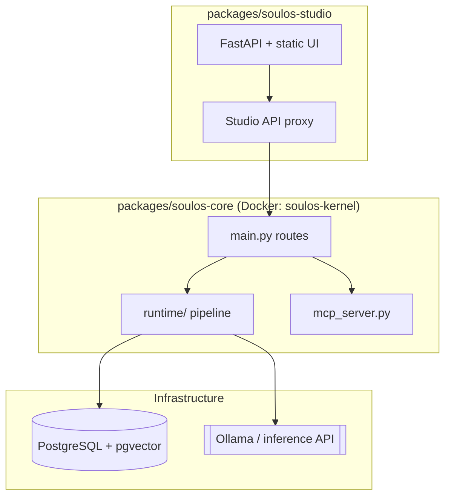

# SoulOS: Architecture & Technical Reference

> **Version:** 0.1 (Open Core)  
> **Status:** Developer Preview  
> **Audience:** Kernel engineers, integrators, and solution architects

---

## Table of Contents

1. [Executive Summary](#1-executive-summary)
2. [Monorepo Topology](#2-monorepo-topology)
3. [Cognitive Runtime Pipeline](#3-cognitive-runtime-pipeline)
4. [Soul Studio (UI)](#4-soul-studio-ui)
5. [Data Models](#5-data-models)
6. [SSE Protocol](#6-sse-protocol)
7. [Deployment](#7-deployment)
8. [Appendices](#8-appendices)

---

## 1. Executive Summary

SoulOS gives AI avatars a persistent **Soul**: HEXACO-based Moral State Vectors (MSV), episodic memory via `pgvector`, and dual-process inference (System 1 text + System 2 `msv_update`). The kernel is MCP-first and consumed via `@soulos/sdk` or direct HTTP.

**Retention driver:** MSV drift and memory crystallization — interactions permanently shift `current_msv`, unlike stateless chat wrappers.

---

## 2. Monorepo Topology

| Path | Role |
|------|------|
| `packages/soulos-core/` | FastAPI kernel (`soulos-kernel`) |
| `packages/soulos-sdk/ts/` | `@soulos/sdk` TypeScript client |
| `packages/soulos-sdk/python/` | `soulos-sdk` Python client |
| `packages/soulos-studio/` | Soul Builder UI (`pip install soulos-studio`) |
| `spec/soul.schema.json` | HEXACO soul contract |
| `examples/` | support-bot, dev-twin, companion |

---

## 3. Cognitive Runtime Pipeline

Kernel logic lives under `packages/soulos-core/runtime/` — not a monolithic `main.py`.

| Module | Stage | Responsibility |
|--------|-------|----------------|
| `runtime/embedder.py` | PERCEIVE | `nomic-embed-text` via inference API |
| `runtime/memory.py` | RECALL | ingest + pgvector similarity retrieve |
| `runtime/pipeline.py` | ACT | System 1 SSE token stream |
| `runtime/reflector.py` | REFLECT | System 2 JSON MSV update |
| `runtime/bootstrap.py` | BOOT | schema init, model pull, health wait |
| `config.py` | — | `DATABASE_URL`, `INFERENCE_API_URL`, engine |
| `dependencies.py` | — | FastAPI `get_db`, `get_embedder`, `get_llm_service` |
| `main.py` | — | HTTP routes only |

**Registration:** `POST /v1/avatars` validates against `spec/soul.schema.json` via `soul_validation.py` and stores `baseline_msv` / `current_msv` (HEXACO, moral foundations, drives).

---

## 4. Soul Studio (UI)

- **CLI** (`soulos-studio`): FastAPI app on port 8765 — `pip install -e packages/soulos-studio`.
- **Static UI** (`soulos_studio/static/`): vanilla HTML/CSS/JS — HEXACO sliders, live JSON preview, radar chart.
- **Kernel proxy** (`soulos_studio/app.py`): `/api/register` and `/api/chat` forward to `SOULOS_KERNEL_URL` for deploy and SSE test chat.
- Soul editing (import/export/validate) works without a running kernel.

---

## 5. Data Models

### `bots`

| Column | Type | Description |
|--------|------|-------------|
| `id` | UUID | Primary key |
| `name`, `role`, `description` | TEXT | Identity |
| `attachment_style` | VARCHAR | e.g. Secure |
| `baseline_msv` | JSONB | Immutable soul at registration |
| `current_msv` | JSONB | Drifting MSV after reflection |
| `capabilities`, `hourly_rate`, `status` | — | Marketplace metadata |

### `episodic_memories`

| Column | Type | Description |
|--------|------|-------------|
| `bot_id` | UUID | FK → `bots` |
| `content` | TEXT | Semantic chunk |
| `embedding` | vector(768) | L2 distance retrieval |

---

## 6. SSE Protocol

`POST /chat/generate` multiplexes:

| Event | Payload |
|-------|---------|
| `message` | `{"text": "..."}` — System 1 tokens |
| `msv_update` | Full MSV JSON — System 2 reflection |

Clients should parse `event:` / `data:` lines (see `@soulos/sdk` `sendMessage`).

---

## 7. Deployment

`docker-compose.yml` services:

- `soulos-kernel` — build `packages/soulos-core/Dockerfile`
- `soulos-studio` — `packages/soulos-studio` (port 8765)
- `db` — Postgres 16 + pgvector
- `ollama` — local inference

Env: `DATABASE_URL`, `INFERENCE_API_URL`, `MODEL_NAME`, `EMBED_MODEL_NAME`.

---

## 8. Appendices

### Glossary

- **MSV:** Moral State Vector (HEXACO + foundations + drives)
- **MCP:** Model Context Protocol (`/mcp/sse`, tools: ingest, MSV update)
- **Memory crystallization:** Persistent shift of `current_msv` from interaction

### Integration paths

| Path | Entry |
|------|-------|
| **MCP** | `GET /mcp/sse` on kernel — [MCP guide](../guides/mcp.md), [tool reference](mcp-tools.md) |
| **SDK** | `@soulos/sdk` (TS) / `soulos-sdk` (Python) — [Quickstart](../getting-started/quickstart.md), [Python bot](../guides/python-bot.md) |
| **Studio** | `soulos-studio` on port 8765 — [Soul Builder](../getting-started/soul-builder.md), [package README](../../packages/soulos-studio/README.md) |

### Regenerating this doc

Run from repo root: `python3 scripts/doc-gen/generate_docs.py`.
