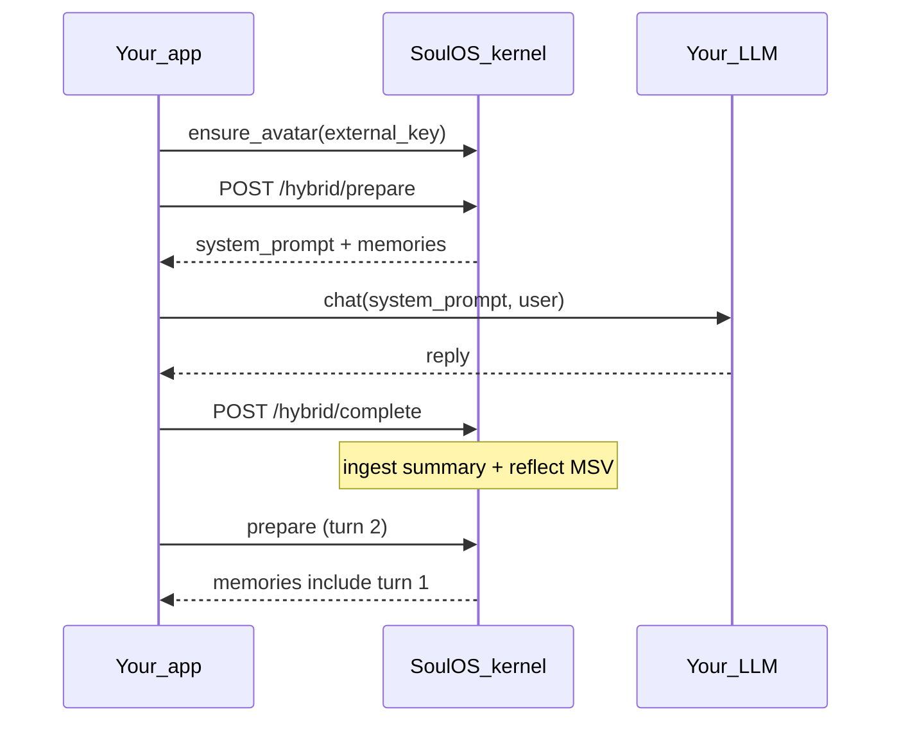

# Tutorial: My first sidecar (15 minutes)

**Level:** beginner · **Audience:** you already call an LLM (OpenAI, Bedrock, LiteLLM, or a mock) · **Outcome:** one hybrid turn with memory recalled on turn 2.

> **Existing LLM app?** This is the recommended first tutorial. Full-chat (`/chat/generate`) is [Python bot](../guides/python-bot.md) or [Quickstart Path A](../getting-started/quickstart.md#path-a).

SoulOS runs **beside** your app. Your LLM still generates tokens. SoulOS owns **identity**, **episodic memory**, and **MSV reflection** via `ensure → prepare → your LLM → complete`.

## Prerequisites

```bash
git clone https://github.com/mziqudhd92/soul-os.git && cd soul-os
docker compose -f docker-compose.sidecar.yml --profile bridge-mock up --build
```

| Service | URL |
|---------|-----|
| Kernel (sidecar) | http://localhost:8001 |
| Mock inference bridge | used by compose profile `bridge-mock` |

Verify readiness:

```bash
curl -s http://localhost:8001/ready
# expect "status":"ok" (HTTP 200)
```

Optional: `pip install -e packages/soulos-sdk/python` for the Python track.

---

## What you will do

1. **Ensure** an avatar (idempotent by `external_key`)
2. **Prepare** — get `system_prompt` + memories
3. Call **your** LLM (or paste a mock reply)
4. **Complete** — ingest summary + optional reflect
5. Prepare again and see **memory recalled**

Two tracks below — pick **curl** or **Python**.

---

## Track A — curl only

### A1 — Ensure avatar

```bash
export KERNEL=http://localhost:8001

curl -s -X POST "$KERNEL/v1/avatars/ensure" \
  -H "Content-Type: application/json" \
  -d '{"external_key":"tutorial-sidecar","soul":'"$(cat examples/support-bot/support-bot.soul.json)"'}' \
  | tee /tmp/ensure.json

export BOT_ID=$(python3 -c "import json; print(json.load(open('/tmp/ensure.json'))['id'])")
echo "bot_id=$BOT_ID"
```

### A2 — Prepare (turn 1)

```bash
curl -s -X POST "$KERNEL/hybrid/prepare" \
  -H "Content-Type: application/json" \
  -d "{\"bot_id\":\"$BOT_ID\",\"query\":\"What is the refund policy?\",\"session_id\":\"sess-demo\"}" \
  | tee /tmp/prepare1.json

python3 -c "import json; print(json.load(open('/tmp/prepare1.json'))['system_prompt'][:600])"
```

Paste that `system_prompt` into your OpenAI/Bedrock call as the system message. For this tutorial, use a mock assistant reply:

```bash
export REPLY="Full refunds are available within 30 days of purchase."
```

### A3 — Complete

```bash
curl -s -X POST "$KERNEL/hybrid/complete" \
  -H "Content-Type: application/json" \
  -d "{\"bot_id\":\"$BOT_ID\",\"summary\":\"User asked about refunds. Answered: $REPLY\",\"user_message\":\"What is the refund policy?\",\"session_id\":\"sess-demo\",\"reflect\":true,\"reflect_async\":true}"
```

### A4 — Prepare again (turn 2 — memory)

```bash
curl -s -X POST "$KERNEL/hybrid/prepare" \
  -H "Content-Type: application/json" \
  -d "{\"bot_id\":\"$BOT_ID\",\"query\":\"Do you remember our refund discussion?\",\"session_id\":\"sess-demo\"}" \
  | python3 -c "import sys,json; d=json.load(sys.stdin); print('memories:', d.get('memories')); print(d['system_prompt'][:500])"
```

You should see the turn-1 summary in `memories` (or woven into `system_prompt`).

---

## Track B — Python `SoulHybridClient.run_turn()`

```python
import asyncio
from soulos import SoulHybridClient

SOUL = {
    "name": "Support Bot",
    "role": "Customer Support",
    "description": "Helpful, policy-aware support agent.",
    "attachment_style": "Secure",
    "baseline_msv": {
        "hexaco": {"H": 0.9, "E": 0.4, "X": 0.5, "A": 0.9, "C": 0.8, "O": 0.5},
        "moral_foundations": {
            "care_harm": 0.9,
            "fairness_cheating": 0.9,
            "loyalty_betrayal": 0.6,
            "authority_subversion": 0.5,
            "sanctity_degradation": 0.4,
        },
        "drives": {"curiosity": 0.4, "autonomy": 0.4, "social_approval": 0.7},
        "epistemic_uncertainty": 0.15,
        "inner_monologue": "Ready to help.",
    },
}


async def mock_llm(system_prompt: str, prepared: dict) -> str:
    # Replace with OpenAI / Bedrock / LiteLLM — use system_prompt as system.
    _ = system_prompt, prepared
    return "Full refunds are available within 30 days of purchase."


async def main() -> None:
    soul = SoulHybridClient(base_url="http://localhost:8001")

    # First turn: optional ensure via external_key + soul
    result = await soul.run_turn(
        "What is the refund policy?",
        mock_llm,
        external_key="tutorial-sidecar-py",
        soul=SOUL,
        session_id="sess-demo",
    )
    print("assistant:", result["reply"])

    # Second turn: same bot_id (set by ensure); memory should appear in prepare
    result = await soul.run_turn(
        "Do you remember our refund discussion?",
        mock_llm,
        session_id="sess-demo",
    )
    print("assistant:", result["reply"])
    print("memories from last prepare are inside the LLM call's prepared dict")


asyncio.run(main())
```

Manual loop (same as `run_turn` internals):

```python
ctx = await soul.prepare_turn(user_message, session_id=session_id)
reply = await mock_llm(ctx["system_prompt"], ctx)
await soul.complete_turn(
    summary=reply[:2000],
    user_message=user_message,
    session_id=session_id,
)
```

See [examples/fastapi-hybrid](../../examples/fastapi-hybrid/README.md) for a full app.

---

## What just happened



| Piece | Role |
|-------|------|
| `external_key` | Stable id so restart does not create duplicate bots |
| `system_prompt` | Identity + recalled facts — paste into **your** LLM |
| `session_id` | Optional per-conversation memory scope |
| `complete` | Writes episodic memory; optional System 2 MSV update |

## Next steps

- [Identity model](../guides/identity-model.md) — tenants, sessions, ensure vs register
- [Hybrid API](../reference/hybrid-api.md) — full JSON shapes
- [Sidecar integration](../guides/sidecar-integration.md) — production compose + gateway
- [Session memory](../guides/session-memory.md) — GDPR forget / session delete
- [Troubleshooting](../guides/troubleshooting.md) — RFC 7807 `code` lookup
